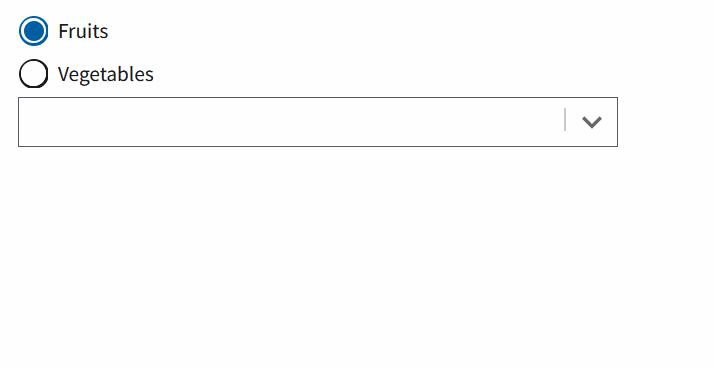

## Usage

`npm install`

`npx webpack serve`

## Issue

when ComboBox `options` prop is updated the displayed options do not change

1. click on combobox - list of fruits is shown
2. select "Vegetables" radio button
3. click on combobox - list of fruits is shown (**expected: vegetables**)
4. click outside combobox (trigger a blur event)
5. click on combobox - now list of vegetables is shown

